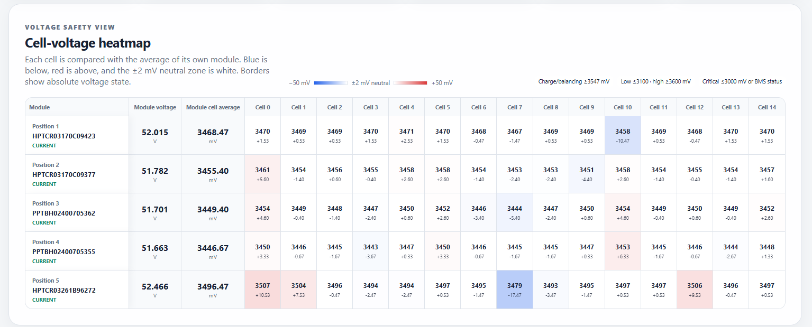

# Pylontech Console

Source-available, read-only monitoring for the undocumented Pylontech RS232
debug console.

## Goal

Pylontech Console is a **read-only monitoring service** for Pylontech battery systems.

Version 0.1 focuses on:

- automatic discovery of installed modules;
- stable module identification by barcode;
- protocol documentation;
- parser implementation based on recorded captures;
- REST API;
- MQTT;
- read-only Web UI including cell heat maps;
- SQLite inventory.

No write commands are implemented in Version 0.1.

## Design Principles

- Contract first
- Read-only
- Barcode = physical identity
- Position = current rack topology
- Automatic discovery
- One internal data model
- Multiple output interfaces (REST, MQTT, Web)

## Architecture

Pylontech → TCP Transport → Response Framing → Parsers → Domain Model → Discovery/Inventory → REST / MQTT / Web / SQLite

## Repository Structure

- docs/architecture - ADRs
- docs/contracts - Version contracts
- docs/development - Implementation plan
- docs/testing - Test strategy
- protocol/ - Protocol specification
- captures/ - Recorded console responses
- src/ - Python implementation
- tests/ - Unit and integration tests

## Entry Point

Development starts with:

1. implementation-plan-v0.1.md
2. ADRs
3. Version contract
4. Protocol documentation
5. Captures

## Important Documents

- docs/contracts/version-0.1.md
- docs/architecture/
- docs/development/implementation-plan-v0.1.md
- docs/testing/test-strategy-v0.1.md
- CONTRIBUTING.md

## Current Status

- Reverse engineering completed.
- Core protocol documented.
- Architecture defined.
- Production service implemented with REST, Web UI and MQTT.
- Running on a five-module mixed Pylontech US2000/US2000C rack.
- Published `linux/amd64` Docker images available from Docker Hub.

## Tested hardware

The verified reference installation uses:

- two Pylontech US2000 modules;
- three Pylontech US2000C modules;
- 15 cells per module and 75 cells in total;
- a Waveshare RS232/485/422 TO POE ETH (B) serial device server;
- Docker on a Proxmox-hosted `linux/amd64` server;
- optional MQTT publishing to ioBroker.

Other Pylontech models, serial adapters and container architectures are not yet
verified. See [`docs/hardware.md`](docs/hardware.md) for the exact compatibility
statement and [`docs/wiring.md`](docs/wiring.md) for the tested cable.

## Cell-voltage heatmap

The Web UI compares every cell with the average of its own module. Blue cells
are below that reference, red cells are above it, and the neutral zone is
white. Independent absolute-voltage markers distinguish imbalance from a cell
approaching a configured safety threshold.

The following screenshot shows live data from the verified five-module mixed
US2000/US2000C rack in the upper charging range:



## Safety

The console exposes read and write commands. Version 0.1 intentionally implements read-only functionality only.

The required `pwrsys` rack command is available only after the console enters
its authenticated debug mode. Configure exactly one credential source:

```bash
export PYLONTECH_CONSOLE_LOGIN_PASSWORD='<console-password>'
```

For production Docker deployments, a password file or Docker Secret is
preferred:

```bash
export PYLONTECH_CONSOLE_LOGIN_PASSWORD_FILE=/run/secrets/pylontech_console_password
```

Example Compose override:

```yaml
services:
  pylontech-console:
    secrets:
      - pylontech_console_password

secrets:
  pylontech_console_password:
    file: ./secrets/pylontech-console-password.txt
```

Keep `PYLONTECH_CONSOLE_LOGIN_PASSWORD` unset when the password-file setting is
used. The two credential sources are mutually exclusive.

The service verifies `pylon_debug>` before polling, re-verifies the session
after every reconnect and attempts `logout` during controlled shutdown. The
credential is never returned by REST, Web, MQTT or health output and is
redacted from application diagnostics.

The Waveshare console connection is unencrypted raw TCP. Place it in a
dedicated technical network/VLAN and permit port `4196` only from the Docker
host running Pylontech Console. The Pylontech login changes console mode; it is
not a substitute for network isolation.

## MQTT

MQTT is disabled by default. To publish the read-only current state, provide at
least:

```bash
export PYLONTECH_MQTT_ENABLED=true
export PYLONTECH_MQTT_HOST=192.168.1.10
docker compose up --build -d
```

The default port is `1883`, client ID is `pylontech-console`, topic prefix is
`pylontech`, and all current-state publications use QoS 1 with retained
payloads. Optional deployment variables configure username/password, TLS,
keepalive, connection timeout, and reconnect limits. Docker Compose passes the
complete `PYLONTECH_MQTT_*` configuration through to the service; the exact
variables and validation rules are defined in
[`docs/contracts/mqtt-v0.1.md`](docs/contracts/mqtt-v0.1.md).

The rack page and `GET /api/v1/health` show MQTT connection state. MQTT remains
publish-only: it subscribes to no command topics and cannot change battery
state.

## Docker Hub images

Published images use:

```text
docker.io/hrabovszki/pylontech-console
```

The current `main` build can be pulled with:

```bash
docker pull hrabovszki/pylontech-console:main
```

Every `main` image also has a commit-specific `sha-*` tag. Version tags such
as `v0.1.0-beta.1` publish `0.1.0-beta.1`; prereleases do not move `latest`.
The `latest` tag is reserved for stable semantic-version releases.

The published container is configured with the same validated
`PYLONTECH_WAVESHARE_*`, `PYLONTECH_CONSOLE_*`, `PYLONTECH_HTTP_*`,
`PYLONTECH_WEB_*` and
`PYLONTECH_MQTT_*` environment variables used by Docker Compose. Images
currently target `linux/amd64`.

## License

Pylontech Console is source-available software. Private, academic and other
non-commercial use is permitted under the
[Pylontech Console Community License](LICENSE). Commercial products, services,
installations, support, internal business use, forks and derived works require
a separate commercial license from the rights holder.
