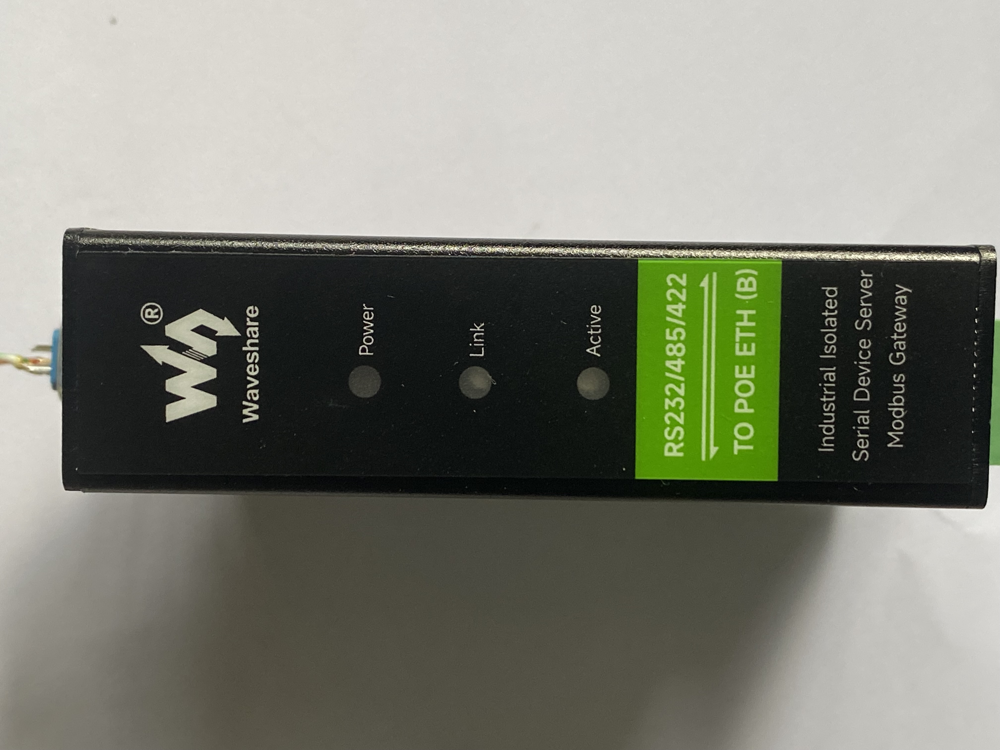
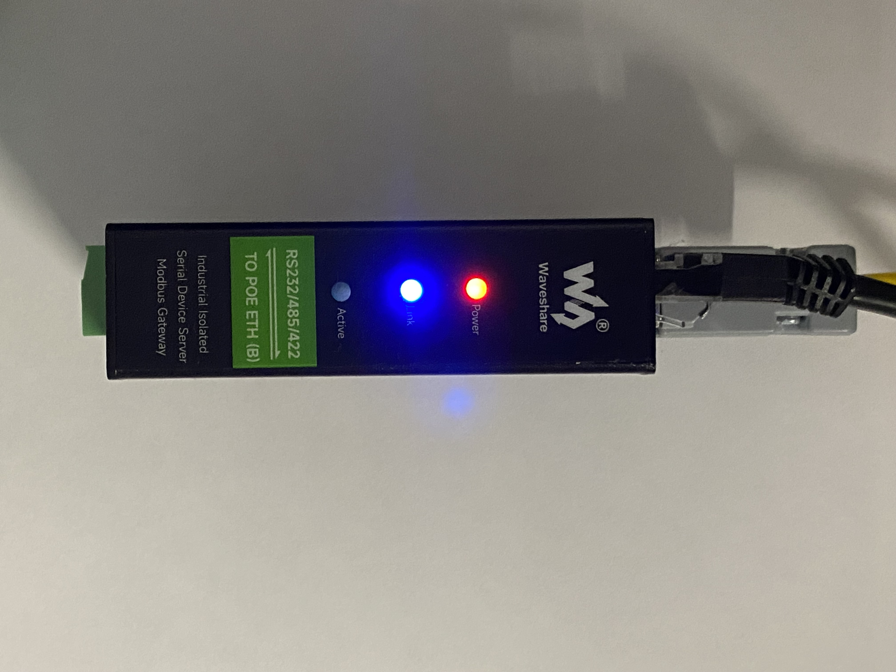
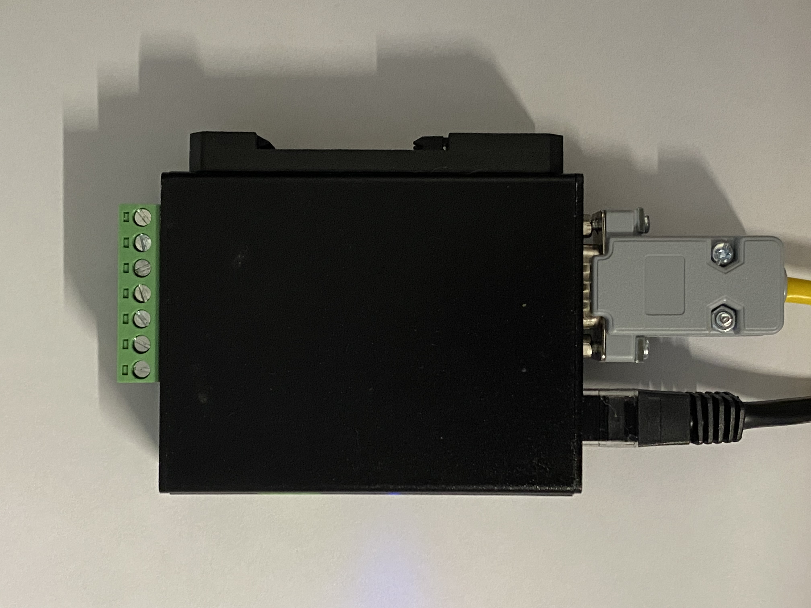
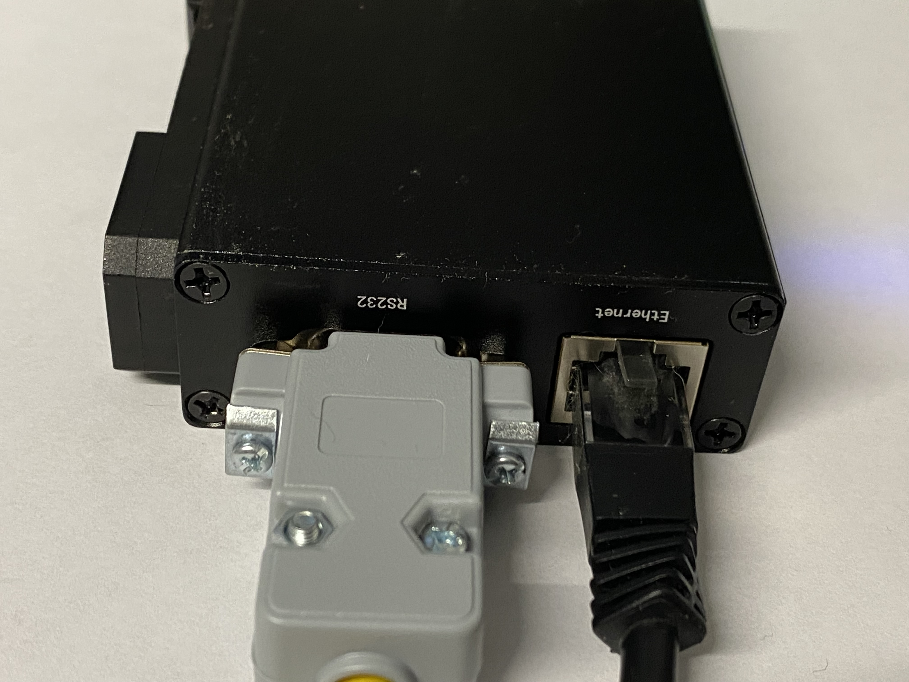

# Waveshare serial device server

This document describes the serial device server verified with Pylontech
Console. It records the actual installation rather than claiming compatibility
with other Waveshare variants.

## Verified device

| Property | Verified value |
|---|---|
| Manufacturer | Waveshare |
| Device | RS232/485/422 TO POE ETH (B) |
| Device class | Industrial isolated serial device server / Modbus gateway |
| Interface used by Pylontech Console | RS232 |
| Network mode used | Transparent TCP |
| Tested TCP port | `4196` |
| Serial configuration | 115200 baud, 8 data bits, no parity, 1 stop bit, no flow control |
| Power and network | PoE over one Ethernet cable |
| Physical installation | DIN rail next to the Pylontech rack |

The Modbus-gateway label describes another capability of the device. Pylontech
Console does not use Modbus: it transports the Pylontech RS232 console stream
unchanged over a TCP connection.

## Why this device is used

The Pylontech modules are installed away from the Proxmox-hosted Docker server.
The serial device server allows the short RS232 connection to remain beside the
battery rack while Ethernet covers the longer distance to the server.

PoE carries data and power over the same cable, so no separate power supply is
required at the device. The supplied mounting adapter allows installation on a
DIN rail in the electrical cabinet beside the batteries. The unit used for the
verified setup cost approximately EUR 35 and provides a compact alternative to
USB passthrough from the Proxmox host into the Docker environment.

## Physical connections

The Ethernet connector carries the TCP connection and PoE supply. The DB9
connector is configured for RS232 and connects to the Pylontech console port
through the tested custom cable.

See [wiring.md](wiring.md) for the confirmed RJ45-to-DB9 pinout. The RJ45
connector on the Pylontech battery is a serial console connector and must never
be connected directly to Ethernet.

## Network security boundary

The Waveshare console bridge and its traffic are not treated as a trusted or
encrypted management channel. In the verified deployment it runs in a separate,
isolated network segment.

The installation should enforce all of the following:

- allow only the Pylontech Console Docker host to connect to TCP port `4196`;
- block access from ordinary client, guest and IoT networks;
- do not expose the serial TCP port or the management interface to the Internet;
- restrict the device management interface to an administrative network;
- change all device default credentials;
- disable unused network services and serial modes where the device permits it;
- avoid a default gateway when routing outside the isolated segment is not
  required;
- keep the Pylontech console login password outside source control and provide
  it to the container through a password file or Docker Secret.

The Pylontech console login and serial payload cross this connection without
transport encryption. Network isolation and firewall rules are therefore part
of the security design, not optional hardening.

## Exclusive console access

Only one client should use the serial console at a time. Do not run PuTTY,
`nc`, another monitoring tool or a second Pylontech Console instance against
the Waveshare while the production container is active. Competing clients can
consume each other's replies, change the persistent console mode or cause
incomplete acquisitions.

Stop the production client before performing a manual console test, and leave
the console in the expected mode before restarting it.

## Installation notes

- Assign a stable address through a static configuration or DHCP reservation.
- Record the TCP port and serial settings with the installation documentation.
- Back up or record the tested Waveshare configuration before firmware or
  network changes.
- Confirm that the PoE source is compatible with the installed device and has
  sufficient power budget.
- Secure the DB9 connector screws and provide strain relief for both cables.
- Keep the unit ventilated and within the environmental limits specified by
  its manufacturer.
- Follow the shield guidance in [wiring.md](wiring.md) and avoid creating an
  unintended ground loop.
- Supplying the PoE switch and Docker server from backed-up power improves
  monitoring availability during short mains interruptions.
